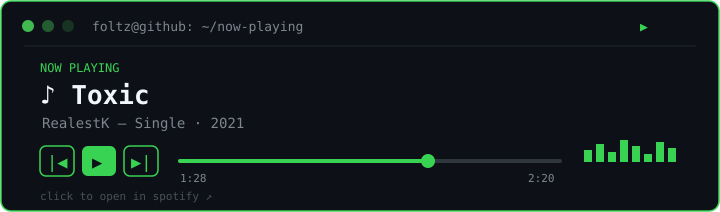

### `~/projects`

<!-- PROJECTS:START -->
| project | what | lang |
|---|---|---|
| [tic-tac-toe](https://github.com/foltzbr/tic-tac-toe) | Retro HTML5 tic-tac-toe, play against the computer or with 2 players | HTML |
| [snake-game](https://github.com/foltzbr/snake-game) | Retro HTML5 snake game, classic Snake to play in the browser | HTML |
| [FoltzWBS](https://github.com/foltzbr/FoltzWBS) | Interactive Python tool to manage webhooks: add, list, verify, delete and send bulk messages | Python |
| [FGUESSER](https://github.com/foltzbr/FGUESSER) | Map cheat for GeoGuessr and OpenGuessr with real location reveal and fast map pin | JavaScript |
| [FZRBX](https://github.com/foltzbr/FZRBX) | Open-source browser extension that displays a fake Robux balance for streaming, videos and UI demos | JavaScript |
<!-- PROJECTS:END -->

### `~/now-playing`

audio doesn't play inside the readme — click to open on spotify · also on [youtube](https://www.youtube.com/watch?v=Hu3kHfmcSr4)

### `~/entertainment`

<table>
<tr>
<td align="center">

 

</td>
<td align="center">

 

</td>
</tr>
</table>
click to play — no install

### `~/activity`

  

  

<!-- PROFILE-BADGES:START -->

<!-- PROFILE-BADGES:END -->

